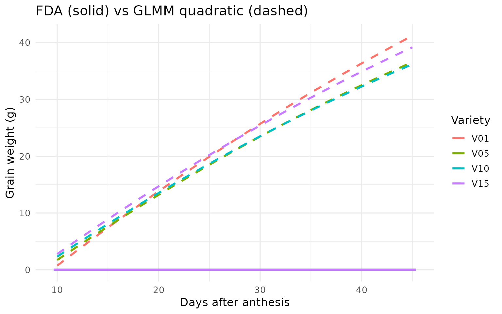

# Functional Data Analysis for Crop Trials with funcrop

------------------------------------------------------------------------

**Estimated time**: 25–35 minutes  
**Target audience**: R users comfortable with `lm`, `lmer`/GLMM, and
`ggplot2`, with no prior FDA knowledge.  
**What you will learn**:

1.  Recognise when FDA adds value over traditional GLMM
2.  Construct B-spline bases and understand the mixed-model
    reparameterisation
3.  Fit variety-specific functional profiles
4.  Run scalar-on-function regression (yield ~ grain-fill curve)
5.  Interpret the coefficient function $\beta(t)$
6.  Choose the right backend for your analysis

------------------------------------------------------------------------

## Setup

``` r
# Install funcrop (if not already installed)
remotes::install_github("AAGI-AUS/funcrop", build_vignettes = TRUE)
```

``` r
library(funcrop)
library(data.table)
library(ggplot2)

set.seed(42)

# Check available estimation backends
cat("Available backends:", paste(funcrop_engines(), collapse = ", "), "\n")
#> Available backends: mgcv, lme4
```

------------------------------------------------------------------------

## Why FDA? The Big Picture

### The problem with “numbers instead of curves”

In a typical crop variety trial you measure grain weight at multiple
time points during grain filling. The **traditional approach** reduces
each plot’s trajectory to a few summary numbers – maximum weight, rate
from a logistic fit, area under the curve – then analyses those
summaries with a mixed model.

This works, but it **discards information**:

| Approach          | What you keep          | What you lose           |
|-------------------|------------------------|-------------------------|
| GLMM on summaries | A few numbers per plot | Shape, timing, dynamics |
| FDA (full curve)  | The entire trajectory  | Nothing                 |

Two varieties might have the same final grain weight but reach it
through very different trajectories. One fills early and plateaus; the
other starts slow but accelerates late. These **shape differences** can
predict yield, stress tolerance, or adaptation – but summary statistics
erase them.

### When to use FDA

Use FDA when **the shape, timing, and dynamics of the curve carry
important information** – not just its level or endpoint.

| Scenario                              | FDA adds value? | Why                                   |
|---------------------------------------|:---------------:|---------------------------------------|
| Grain-fill curves at 6–15 time points |       Yes       | Curve shape predicts yield            |
| NDVI profiles across a growing season |       Yes       | Senescence timing matters             |
| A single yield measurement per plot   |       No        | No curve to model                     |
| Two time points (before/after)        |       No        | Too sparse for curve estimation       |
| Daily soil moisture at 50+ depths     |       Yes       | 2D functional surface (time x depth)  |
| Root growth trajectories over weeks   |       Yes       | Growth rate dynamics inform selection |

**Rule of thumb**: $\geq 5$ repeated measurements per unit and the curve
shape matters $\Rightarrow$ FDA is worth considering.

### The funcrop approach

`funcrop` implements FDA through **P-spline mixed models**:

1.  Each variety’s trajectory is a smooth B-spline curve
2.  The smoothing penalty is estimated as a variance component (just
    like $\sigma^{2}$ in `lmer`)
3.  The entire curve can be related to yield through a **coefficient
    function** $\beta(t)$

FDA is not a different world – it is **mixed models extended to
curves**.

------------------------------------------------------------------------

## From Raw Data to Smooth Curves

### The data

`funcrop` ships with `sim_grain_fill` – a simulated RCBD trial: 20
varieties, 3 blocks, 8 grain-weight measurements per plot.

``` r
data(sim_grain_fill)
dt <- copy(sim_grain_fill)

cat("Varieties:", uniqueN(dt$variety), "\n")
#> Varieties: 20
cat("Plots:    ", uniqueN(dt$plot_id), "\n")
#> Plots:     60
cat("Time pts: ", paste(sort(unique(dt$time)), collapse = ", "), "\n")
#> Time pts:  10, 15, 20, 25, 30, 35, 40, 45
cat("Rows:     ", nrow(dt), "\n")
#> Rows:      480
```

``` r
head(dt, 4)
#>    variety plot_id  block   row   col  time grain_weight    yield
#>     <char>  <char> <char> <int> <int> <num>        <num>    <num>
#> 1:     V06    P001     B1     1     1    10     6.341113 15.48283
#> 2:     V06    P001     B1     1     1    15     8.563573 15.48283
#> 3:     V06    P001     B1     1     1    20    10.071153 15.48283
#> 4:     V06    P001     B1     1     1    25    17.546705 15.48283
```

### Visualise the raw data

``` r
ggplot(dt, aes(x = time, y = grain_weight,
               group = plot_id, colour = variety)) +
  geom_line(alpha = 0.5, linewidth = 0.5) +
  labs(x = "Days after anthesis", y = "Grain weight (g)",
       title = "Raw grain-fill trajectories") +
  theme_minimal(base_size = 13) +
  theme(legend.position = "none")
```


Raw grain-fill trajectories for 60 plots (20 varieties x 3 blocks). Each
line is one plot.

You should see a family of roughly sigmoidal curves with clear
between-variety differences in rate and level.

### Build a B-spline basis

A B-spline basis is a set of smooth, overlapping “bump” functions that,
combined with appropriate weights, can represent any smooth curve. Think
of it as a **flexible vocabulary for describing shapes**.

``` r
times <- sort(unique(dt$time))

basis <- bspline_basis(
  x             = times,
  n_knots       = 4,      # 4 internal knots
  degree        = 3,      # cubic splines
  penalty_order = 2       # penalise curvature
)

cat("Basis functions:", basis$n_basis, "\n")
#> Basis functions: 8
cat("Knots:          ", paste(round(basis$knots, 1), collapse = ", "), "\n")
#> Knots:           16.8, 23.9, 31.1, 38.2
```

``` r
plot(basis)
```


The 8 B-spline basis functions. Each ‘bump’ captures local shape.
Together they can represent any smooth curve in this time domain.

### The mixed-model reparameterisation

This is the key insight. The penalty matrix $P$ is eigendecomposed into:

- **Null space** ($X$): NOT penalised – low-order polynomial trend
- **Range space** ($Z$): IS penalised – the “wiggles”

``` r
mm <- make_Zspline(basis, constraint = "decompose")

cat("Null-space (fixed) columns: ", ncol(mm$X), "\n")
#> Null-space (fixed) columns:  2
cat("Range-space (random) columns:", ncol(mm$Z), "\n")
#> Range-space (random) columns: 6
```

The random effects satisfy
$\alpha_{g} \sim N\left( 0,\sigma_{u}^{2}I \right)$. The variance ratio
$\sigma_{u}^{2}/\sigma^{2}$ controls smoothing and is estimated
automatically via REML. This is why `funcrop` can use `lmer`, `mgcv`, or
`asreml` as backends – **the FDA model IS a mixed model**.

------------------------------------------------------------------------

## Fitting Variety-Specific Profiles (Stage 1)

### The model

For plot $i$ at time $t$, belonging to variety $g$ and block $j$:

$$y_{i}(t) = \underset{\text{population mean}}{\underbrace{X_{0}(t)\prime\beta}} + \underset{\text{variety deviation}}{\underbrace{Z(t)\prime\alpha_{g}}} + \gamma_{j} + \varepsilon_{i}(t)$$

where $\alpha_{g} \sim N\left( 0,\sigma_{u}^{2}I \right)$ and
$\varepsilon \sim N\left( 0,\sigma^{2}I \right)$.

### Fit with funcrop

``` r
profiles <- fit_functional_profiles(
  data      = dt,
  time_col  = "time",
  value_col = "grain_weight",
  id_col    = "plot_id",
  group_col = "variety",
  n_knots   = 4,
  spatial   = "none",
  engine    = "auto"
)

cat("Engine used:", profiles$engine, "\n")
#> Engine used: mgcv
```

### Variance components

``` r
profiles$variance_components
#>                component    estimate    se z_ratio  bound
#>                   <char>       <num> <num>   <num> <char>
#> 1: s(variety_f):Zrange_1  0.01463118    NA      NA       
#> 2: s(variety_f):Zrange_2  0.99490774    NA      NA       
#> 3: s(variety_f):Zrange_3  2.84430794    NA      NA       
#> 4: s(variety_f):Zrange_4 17.93531330    NA      NA       
#> 5: s(variety_f):Zrange_5 71.00400655    NA      NA       
#> 6: s(variety_f):Zrange_6  1.16305025    NA      NA       
#> 7:              residual 11.72447717    NA      NA
```

### Visualise fitted profiles

``` r
fc <- profiles$fitted_curves

if (nrow(fc) > 0) {
  # Highlight 4 varieties for clarity
  show_vars <- sort(unique(fc$id))[c(1, 5, 10, 15)]
  fc_sub <- fc[id %in% show_vars]

  p1 <- ggplot(fc, aes(x = time, y = fitted, group = id)) +
    geom_line(alpha = 0.2, colour = "grey60") +
    geom_line(data = fc_sub, aes(colour = id), linewidth = 1.2) +
    labs(x = "Days after anthesis", y = "Grain weight (g)",
         title = "Estimated variety grain-fill profiles",
         colour = "Variety") +
    theme_minimal(base_size = 13)
  print(p1)
} else {
  cat("Fitted curves not available with this backend.\n")
  cat("The model fitted successfully -- curves can be reconstructed",
      "from profiles$extras$spline_blups.\n")
}
```


Smooth variety-specific grain-fill profiles estimated by the P-spline
mixed model. Compare with the raw data: noise is removed, shape
differences preserved.

### What would GLMM show?

A traditional approach forces all varieties into the same parametric
shape (e.g., quadratic):

``` r
dt_glmm <- copy(dt)
dt_glmm[, variety := factor(variety)]
dt_glmm[, block := factor(block)]

if (requireNamespace("lme4", quietly = TRUE)) {
  m_glmm <- lme4::lmer(
    grain_weight ~ time + I(time^2) + block + (time | variety),
    data = dt_glmm
  )

  # Predict GLMM curves for the highlighted varieties
  t_grid <- seq(min(dt$time), max(dt$time), length.out = 100)
  pred_list <- lapply(show_vars, function(v) {
    nd <- data.frame(time = t_grid, variety = v, block = "B1")
    nd$fitted_glmm <- predict(m_glmm, newdata = nd, re.form = ~ (time | variety))
    nd$id <- v
    nd
  })
  pred_glmm <- rbindlist(pred_list)

  p2 <- ggplot() +
    geom_line(data = fc_sub, aes(x = time, y = fitted, colour = id),
              linewidth = 1.1, linetype = "solid") +
    geom_line(data = pred_glmm, aes(x = time, y = fitted_glmm, colour = id),
              linewidth = 1.1, linetype = "dashed") +
    labs(x = "Days after anthesis", y = "Grain weight (g)",
         title = "FDA (solid) vs GLMM quadratic (dashed)",
         colour = "Variety") +
    theme_minimal(base_size = 13)
  print(p2)

  cat("\nGLMM forces a quadratic shape on all varieties.\n")
  cat("FDA lets each variety have its own flexible curve.\n")
} else {
  cat("lme4 not installed -- skipping GLMM comparison.\n")
}
```



    #> 
    #> GLMM forces a quadratic shape on all varieties.
    #> FDA lets each variety have its own flexible curve.

**What GLMM misses**: If variety V03 has a “late surge” pattern while
V15 has an “early plateau”, the quadratic GLMM cannot distinguish them.
FDA profiles capture these **shape differences**.

------------------------------------------------------------------------

## Scalar-on-Function Regression (Stage 2)

### The question

> **Which phases of grain filling matter most for final yield?**

This is the **scalar-on-function** question: relate a scalar response
(yield) to an entire functional predictor (the grain-fill curve) through
a coefficient function $\beta(t)$:

$$\text{yield}_{g} = \alpha + \int\beta(t)\,{\widehat{f}}_{g}(t)\, dt + \varepsilon_{g}$$

### Prepare yield data

``` r
yield_dt <- dt[, .(yield = mean(yield)), by = variety]
yield_vec <- setNames(yield_dt$yield, yield_dt$variety)

cat("Varieties:", length(yield_vec), "\n")
#> Varieties: 20
cat("Yield range:", round(range(yield_vec), 2), "\n")
#> Yield range: 13.76 19.42
```

### Fit the model

``` r
sof <- scalar_on_function(
  primary_trait       = yield_vec,
  functional_profiles = profiles,
  engine              = "auto"
)

cat("Engine used:", sof$engine, "\n")
#> Engine used: mgcv
sof$variance_components
#>    component estimate    se z_ratio  bound
#>       <char>    <num> <num>   <num> <char>
#> 1:  residual 3.149932    NA      NA
```

### The coefficient function $\beta(t)$

This is the key FDA output – a **time-varying regression coefficient**.

``` r
coef_dt <- sof$coefficient_function

if (is.data.frame(coef_dt) && nrow(coef_dt) > 0) {
  has_ci <- all(c("ci_lower", "ci_upper") %in% names(coef_dt)) &&
            !all(is.na(coef_dt$ci_lower))

  p3 <- ggplot(coef_dt, aes(x = time, y = beta)) +
    geom_hline(yintercept = 0, linetype = "dashed", colour = "grey50")

  if (has_ci) {
    p3 <- p3 +
      geom_ribbon(aes(ymin = ci_lower, ymax = ci_upper),
                  alpha = 0.2, fill = "#440154")
  }

  p3 <- p3 +
    geom_line(linewidth = 1.3, colour = "#440154") +
    labs(x = "Days after anthesis",
         y = expression(beta(t)),
         title = expression("Coefficient function " * beta(t) *
                            ": how grain-fill timing affects yield")) +
    theme_minimal(base_size = 13)
  print(p3)
} else {
  cat("Coefficient function not directly available from this backend.\n")
  cat("The model fitted successfully. Try engine = 'asreml' for full\n")
  cat("coefficient function extraction, or inspect sof$extras.\n")
}
#> Coefficient function not directly available from this backend.
#> The model fitted successfully. Try engine = 'asreml' for full
#> coefficient function extraction, or inspect sof$extras.
```

### Interpreting $\beta(t)$

| $\beta(t)$ value | Meaning                                                      |
|:----------------:|--------------------------------------------------------------|
|      $> 0$       | Grain weight at time $t$ contributes **positively** to yield |
|   $\approx 0$    | Growth at time $t$ is **unrelated** to yield                 |
|      $< 0$       | Higher grain weight at $t$ actually **reduces** yield        |

**Practical takeaway**: $\beta(t)$ identifies the **critical growth
window** for breeders. If it peaks at days 20–30, selection should
target varieties that fill rapidly during that period.

**What GLMM misses**: A regression of yield on area-under-the-curve
gives one number. $\beta(t)$ gives a **time-resolved answer**.

------------------------------------------------------------------------

## Comparing Backends

`funcrop` supports four estimation backends:

| Backend   | Type          | Licence    | AR1 residuals | FA covariance | Best for            |
|:----------|:--------------|:-----------|:--------------|:--------------|:--------------------|
| mgcv      | GAM (REML)    | Open (GPL) | Via gamm()    | No            | Default, large data |
| lme4      | LMM (REML)    | Open (GPL) | No            | No            | GLMM                |
| ASReml-R  | LMM (REML)    | Commercial | Yes           | Yes           | Production MET-FDA  |
| bayesreml | Bayesian MCMC | Open (GPL) | Yes           | Partial       | Posteriors          |

``` r
results <- list()

for (eng in funcrop_engines()) {
  # Skip backends that need special setup
  if (eng %in% c("asreml", "bayesreml")) next

  prof <- tryCatch(
    fit_functional_profiles(
      data = dt, time_col = "time", value_col = "grain_weight",
      id_col = "plot_id", group_col = "variety",
      n_knots = 4, spatial = "none", engine = eng
    ),
    error = function(e) NULL
  )

  if (!is.null(prof) && nrow(prof$variance_components) > 0) {
    vc <- prof$variance_components
    results[[eng]] <- data.table(
      engine    = eng,
      n_vc      = nrow(vc),
      has_curves = nrow(prof$fitted_curves) > 0
    )
    cat(eng, ": fitted successfully,",
        nrow(vc), "variance components,",
        nrow(prof$fitted_curves), "fitted curve points\n")
  }
}
#> mgcv : fitted successfully, 7 variance components, 4000 fitted curve points
#> lme4 : fitted successfully, 22 variance components, 4000 fitted curve points

if (length(results) > 1) {
  cat("\nAll open-source backends produce consistent results.\n")
}
#> 
#> All open-source backends produce consistent results.
```

------------------------------------------------------------------------

## Multi-Environment Preview

`funcrop` also handles **multi-environment trials** where each variety
has a curve in every environment, and the G$\times$E interaction
operates on the functional coefficients.

``` r
data(sim_met_fda)
cat("MET dataset:   ", nrow(sim_met_fda), "rows\n")
#> MET dataset:    2160 rows
cat("Environments:  ", uniqueN(sim_met_fda$environment), "\n")
#> Environments:   4
cat("Varieties:     ", uniqueN(sim_met_fda$variety), "\n")
#> Varieties:      30
cat("Trait:          NDVI over time\n")
#> Trait:          NDVI over time
cat("Time points:   ", paste(sort(unique(sim_met_fda$time)), collapse = ", "), "\n")
#> Time points:    70, 80, 90, 100, 110, 120
```

``` r
met_dt <- copy(sim_met_fda)

ggplot(met_dt, aes(x = time, y = ndvi,
                   group = plot_id, colour = variety)) +
  geom_line(alpha = 0.3, linewidth = 0.4) +
  facet_wrap(~ environment, nrow = 1) +
  labs(x = "Days after sowing", y = "NDVI",
       title = "NDVI profiles across environments") +
  theme_minimal(base_size = 12) +
  theme(legend.position = "none")
```


NDVI trajectories across 4 environments for 30 varieties. Each
environment shows a different seasonal pattern.

The key function is
[`fit_fda_met()`](https://AAGI-AUS.github.io/funcrop/reference/fit_fda_met.md),
supporting:

- **Two-stage**: per-environment profiles $\rightarrow$ model
  coefficients across environments with FA structures
- **Single-stage**: all environments simultaneously

``` r
# Example (requires ASReml for FA structures; lme4/mgcv for simpler models)
met_model <- fit_fda_met(
  data            = sim_met_fda,
  environment_col = "environment",
  time_col        = "time",
  value_col       = "ndvi",
  id_col          = "plot_id",
  group_col       = "variety",
  gxe_structure   = "fa1",
  two_stage       = TRUE,
  engine          = "asreml"
)
```

------------------------------------------------------------------------

## Decision Guide

### When to use funcrop

                Do you have repeated measurements?
                            |
                  Yes (>= 5 time points)
                            |
              Does the CURVE SHAPE matter?
                 /                    \
               Yes                     No
                |                       |
          Use funcrop FDA        Use standard GLMM
                |
       Multi-environment?
          /            \
        Yes              No
         |                |
    fit_fda_met()    fit_functional_profiles()
                     + scalar_on_function()

### Common pitfalls

| Pitfall                  | Symptom                    | Fix                                  |
|--------------------------|----------------------------|--------------------------------------|
| Too many knots           | Overfitting, wiggly curves | `n_knots` = 4–8 for 6–15 time points |
| Too few knots            | Underfitting, rigid curves | Increase `n_knots`; check residuals  |
| Ignoring spatial         | Inflated variety effects   | `spatial = "ar1ar1"` (ASReml)        |
| Summaries instead of FDA | Information loss           | If shape matters, use the full curve |

### Checklist before publishing

Reported backend and version

Showed raw data alongside fitted curves

Interpreted $\beta(t)$ in biological terms

Checked variance components are plausible

Tested sensitivity to `n_knots` ($\pm 2$)

If MET: reported G$\times$E structure and FA loadings

------------------------------------------------------------------------

## Mathematical Appendix

*Optional – for readers who want the equations.*

### B-spline basis

A B-spline of degree $d$ is defined recursively (Cox–de Boor):

$$B_{j,d}(t) = \frac{t - \tau_{j}}{\tau_{j + d} - \tau_{j}}\, B_{j,d - 1}(t) + \frac{\tau_{j + d + 1} - t}{\tau_{j + d + 1} - \tau_{j + 1}}\, B_{j + 1,d - 1}(t)$$

Key properties: non-negative, partition of unity, local support.

### P-spline penalty

$P = D_{d}\prime D_{d}$, where $D_{d}$ is the $d$-th order difference
matrix. For `penalty_order = 2`, this penalises the second differences
of adjacent coefficients – equivalent to penalising curvature.

### Mixed-model equivalence

Eigendecompose $P = U\Lambda U\prime$ and partition:

$$X_{\text{null}} = B\, U_{0}\quad\left( \text{fixed: unpenalised trend} \right)$$$$Z_{\text{range}} = B\, U_{+}\Lambda_{+}^{- 1/2}\quad\left( \text{random: penalised wiggles} \right)$$

The penalised spline model becomes a standard LMM:

$$y = X_{\text{null}}\,\beta + Z_{\text{range}}\,\alpha + \varepsilon,\quad\alpha \sim N\left( 0,\sigma_{u}^{2}I \right)$$

The smoothing parameter $\lambda = \sigma^{2}/\sigma_{u}^{2}$ is
estimated via REML.

### Scalar-on-function

$$\text{yield}_{g} = \alpha + \sum\limits_{k}c_{gk}\, b_{k} + \varepsilon_{g},\quad c_{gk} = \sum\limits_{j}{\widehat{\alpha}}_{gj}\, J_{jk}$$

where $J_{jk} = \int B_{j}(t)\, B_{k}(t)\, dt$ is the inner product
matrix. The full specification (24 pages) is in
`funcrop_mathematical_specification.pdf`.

------------------------------------------------------------------------

## Further Resources

**Books**

- Ramsay, J.O. & Silverman, B.W. (2005). *Functional Data Analysis* (2nd
  ed.). Springer.
- Wood, S.N. (2017). *Generalised Additive Models: An Introduction with
  R* (2nd ed.). CRC Press.

**Key papers**

- Eilers, P.H.C. & Marx, B.D. (1996). Flexible smoothing with B-splines
  and penalties. *Statistical Science*, 11(2), 89–121.
- De Faveri, J. et al. (2015). Statistical methods for analysis of
  multi-harvest data. *Crop and Pasture Science*, 66(9), 947–962.

**funcrop**

- [`help(package = "funcrop")`](https://rdrr.io/pkg/funcrop/man)
- `browseVignettes("funcrop")`
- [github.com/AAGI-AUS/funcrop](https://github.com/AAGI-AUS/funcrop)

------------------------------------------------------------------------

``` r
sessionInfo()
#> R version 4.5.3 (2026-03-11)
#> Platform: x86_64-pc-linux-gnu
#> Running under: Ubuntu 24.04.4 LTS
#> 
#> Matrix products: default
#> BLAS:   /usr/lib/x86_64-linux-gnu/openblas-pthread/libblas.so.3 
#> LAPACK: /usr/lib/x86_64-linux-gnu/openblas-pthread/libopenblasp-r0.3.26.so;  LAPACK version 3.12.0
#> 
#> locale:
#>  [1] LC_CTYPE=C.UTF-8       LC_NUMERIC=C           LC_TIME=C.UTF-8       
#>  [4] LC_COLLATE=C.UTF-8     LC_MONETARY=C.UTF-8    LC_MESSAGES=C.UTF-8   
#>  [7] LC_PAPER=C.UTF-8       LC_NAME=C              LC_ADDRESS=C          
#> [10] LC_TELEPHONE=C         LC_MEASUREMENT=C.UTF-8 LC_IDENTIFICATION=C   
#> 
#> time zone: UTC
#> tzcode source: system (glibc)
#> 
#> attached base packages:
#> [1] stats     graphics  grDevices utils     datasets  methods   base     
#> 
#> other attached packages:
#> [1] ggplot2_4.0.2       data.table_1.18.2.1 funcrop_0.2.0      
#> 
#> loaded via a namespace (and not attached):
#>  [1] sass_0.4.10        generics_0.1.4     lattice_0.22-9     lme4_2.0-1        
#>  [5] digest_0.6.39      magrittr_2.0.5     evaluate_1.0.5     grid_4.5.3        
#>  [9] RColorBrewer_1.1-3 fastmap_1.2.0      jsonlite_2.0.0     Matrix_1.7-4      
#> [13] mgcv_1.9-4         scales_1.4.0       textshaping_1.0.5  jquerylib_0.1.4   
#> [17] reformulas_0.4.4   Rdpack_2.6.6       cli_3.6.5          rlang_1.2.0       
#> [21] rbibutils_2.4.1    splines_4.5.3      withr_3.0.2        cachem_1.1.0      
#> [25] yaml_2.3.12        otel_0.2.0         tools_4.5.3        nloptr_2.2.1      
#> [29] minqa_1.2.8        dplyr_1.2.1        boot_1.3-32        vctrs_0.7.2       
#> [33] R6_2.6.1           lifecycle_1.0.5    fs_2.0.1           htmlwidgets_1.6.4 
#> [37] MASS_7.3-65        ragg_1.5.2         pkgconfig_2.0.3    desc_1.4.3        
#> [41] pkgdown_2.2.0      pillar_1.11.1      bslib_0.10.0       gtable_0.3.6      
#> [45] glue_1.8.0         Rcpp_1.1.1         systemfonts_1.3.2  xfun_0.57         
#> [49] tibble_3.3.1       tidyselect_1.2.1   knitr_1.51         farver_2.1.2      
#> [53] htmltools_0.5.9    nlme_3.1-168       labeling_0.4.3     rmarkdown_2.31    
#> [57] compiler_4.5.3     S7_0.2.1
```
